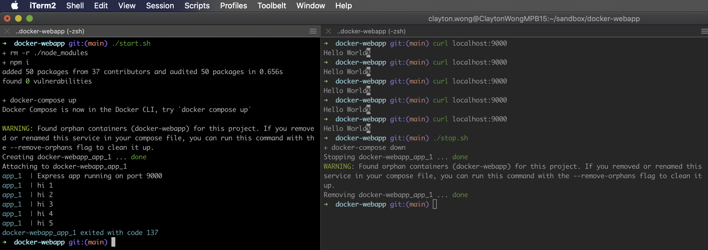

# docker-webapp

This is an example express server `node` application which is executed within a `docker` image configured via `docker compose` to expose port mappings and volume mounts:
* Port `9000` is exposed from the docker image and mapped to host port `9000`
* The root directory of this project is the current working directory `./` which is mounted as `/app`

Each `http get /` request is responded with `hi x` where `x` is a monotonically increasing value (see sample usage below).

## Usage
Use `start.sh` and `stop.sh` to start and stop the container.

